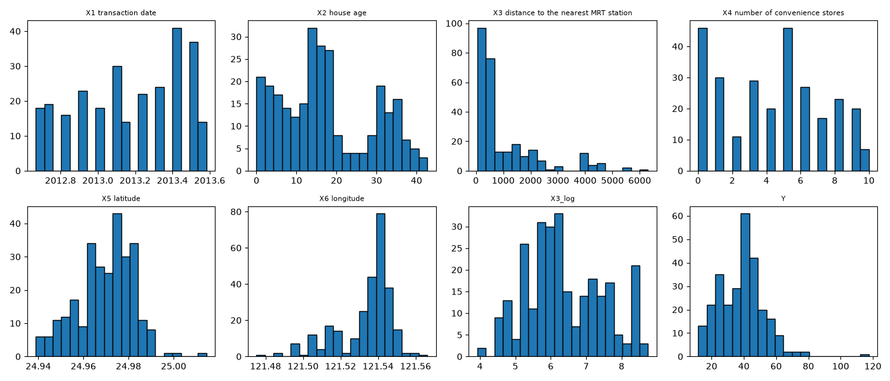
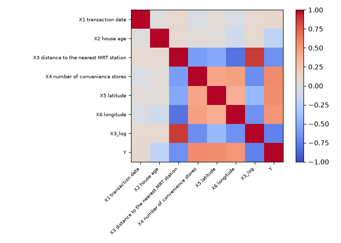
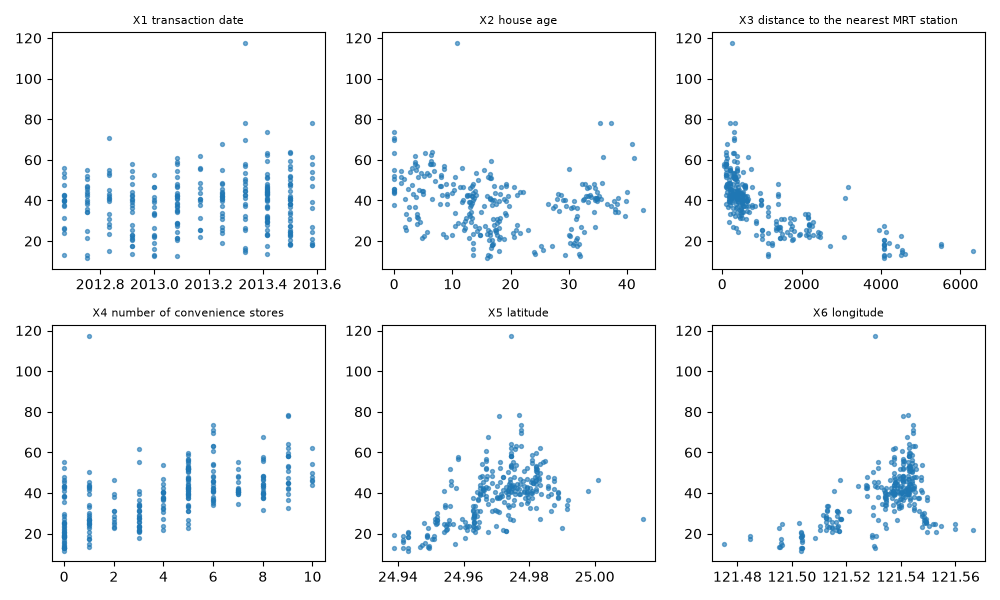

# UCI Real Estate Valuation Prediction

Regression pipeline for [UCI dataset 477](https://archive.ics.uci.edu/dataset/477/real+estate+valuation+data+set).

## Setup

```bash
uv venv
uv pip install -r requirements.txt
```

## Run

```bash
uv run python main.py
```

Or open `main.py` in VS Code and run `# %%` cells.

## Output

CV model comparison and test metrics print to the terminal.

<p align="center">
  
  <br />
  <em>Figure 1. Feature and target distributions</em>
</p>

<p align="center">
  
  <br />
  <em>Figure 2. Correlation heatmap</em>
</p>

<p align="center">
  
  <br />
  <em>Figure 3. Feature vs price scatter plots</em>
</p>
